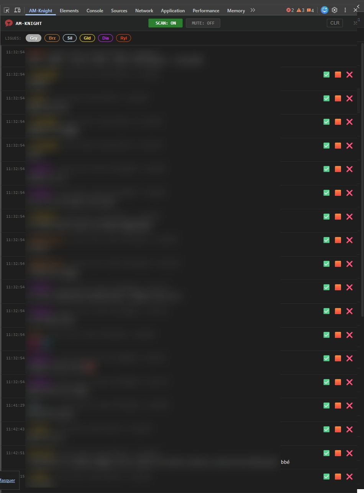
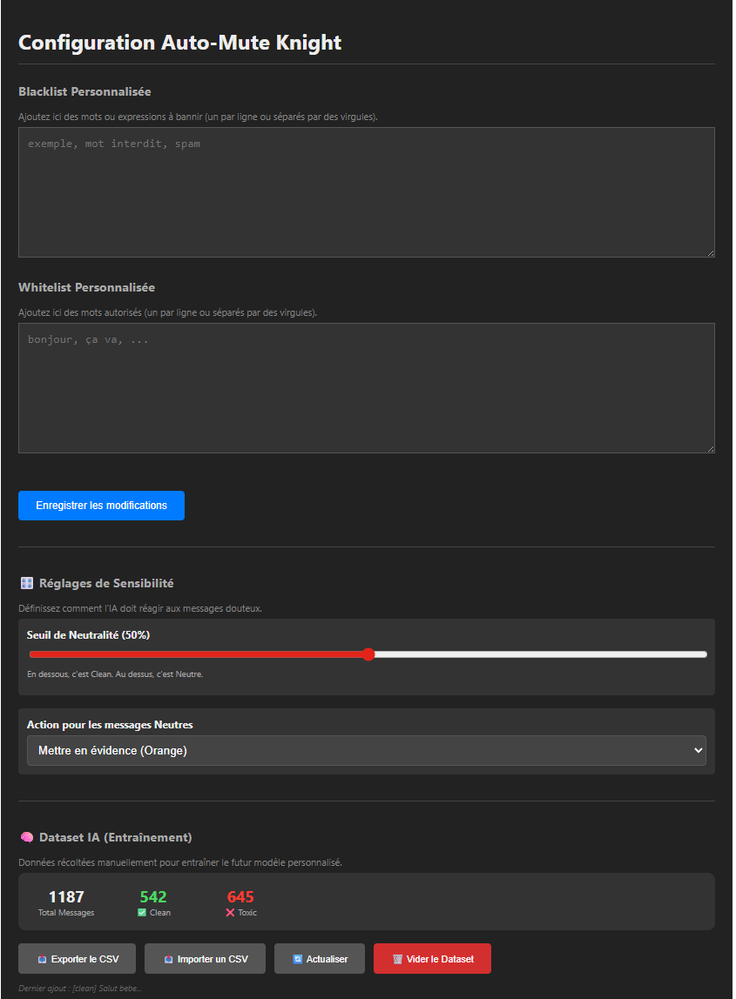

# SAM-Knight 🛡️

**SAM-Knight** is an open-source Google Chrome Extension (Manifest V3) designed to assist moderators ("Knights") on the Stripchat platform. It combines classic algorithms with embedded Artificial Intelligence to automatically filter chat messages.



## ✨ Features

- **Hybrid Filtering:** Aho-Corasick algorithms (exact words) + Fuzzy Matching (typo tolerance).
- **Embedded AI (Privacy First):** Uses a distilled BERT model (TensorFlow.js) running **locally** in your browser. No chat data is sent to external servers.
- **3-Zone Sensitivity Control:** Define custom thresholds for **Clean**, **Neutral**, and **Toxic** messages via a double-slider interface.
- **Smart Neutral Actions:** Suspicious messages can be automatically highlighted or partially hidden based on your preference.
- **Dataset Management:** Built-in tools to import/export and track statistics of your own moderation data (CSV).
- **Console Overlay:** Unobtrusive interface injected directly into the page to monitor moderation actions in real-time.
- **Developer Mode:** Dedicated DevTools panel for advanced debugging.

## ⚙️ Configuration

Manage your rules and settings via a dedicated interface:



- **Blacklist / Whitelist** management (CSV Import/Export).
- AI detection threshold configuration.

---

## 🚀 Installation & Development

### Prerequisites

- **Node.js** (v18+)
- **NPM** (included with Node)
- **Python 3.10+** (Only if you wish to retrain the AI)

### 1. Project Setup

```bash
# Clone the repository
git clone https://github.com/frisouilles/SAM-Knight.git
cd SAM-Knight

# Install JS dependencies
npm install
```

### 2. Build the Extension

To generate the ready-to-use extension (`dist/` folder):

```bash
npm run build
```

### 3. Load in Chrome

1. Open Chrome and go to `chrome://extensions/`.
2. Enable **Developer mode** (top right).
3. Click **Load unpacked**.
4. Select the `dist` folder generated in the previous step.

### 4. Development Mode (Hot Reload)

To develop with automatic reloading:

```bash
npm run dev
```

---

## 🧠 AI Training (Advanced)

The extension comes with a generic pre-trained model in `public/model/`. If you wish to fine-tune detection with your own data:

### 1. Prepare Data

Create a file named `training/stripchat_training_data.csv`.
This file is **not included** in the repository for privacy reasons.
Expected Format (CSV):

```csv
text,label
"hello how are you",clean
"very bad insult",toxic
"follow my insta",neutral
```

- **clean**: Normal message.
- **toxic**: Insult, harassment, severe spam.
- **neutral**: Light spam (social media ads), technical questions.

### 2. Run Training

The script will create a Python virtual environment, install PyTorch/Transformers, train the model, and export it to ONNX format for the web.

```bash
npm run train
```

Once finished, the new model will automatically replace the one in `public/model/`. Rebuild the extension (`npm run build`) to apply changes.

---

## 🛠️ Technical Architecture

- **Core:** Vue.js 3 + Vite + CRXJS Plugin.
- **AI:** Transformers.js / ONNX Runtime Web (WASM).
- **Communication:** The AI runs in an `Offscreen Document` to avoid blocking Stripchat's main thread (UI).

## ⚠️ Disclaimer

This project is independent and not affiliated with Stripchat. Use it responsibly and in accordance with the platform's terms of service.